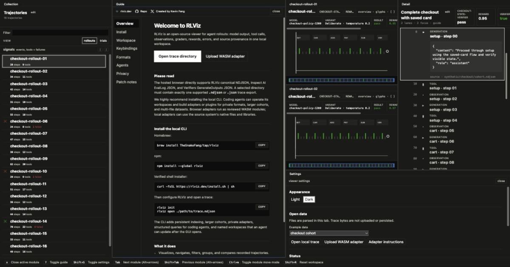

# RLViz

[](https://github.com/TheSnakeFang/rlviz/actions/workflows/ci.yml)
[](https://github.com/TheSnakeFang/rlviz/releases/latest)
[](https://www.npmjs.com/package/rlviz)
[](LICENSE)

Inspect agent rollouts locally.

RLViz opens existing agent traces in a keyboard-first viewer. Read each model,
tool, environment, grader, and artifact event; compare trajectories; and trace
normalized data back to its raw source record. The source is never modified.



Open a supported file directly at [rlviz.dev](https://rlviz.dev). Parsing and
indexing stay in the browser tab. Use the CLI for larger traces, growing files,
private formats, and local adapters.

## Quickstart

```bash
brew install TheSnakeFang/tap/rlviz
rlviz inspect ./path/to/rollout.ndjson
rlviz open ./path/to/rollout.ndjson
```

Other installation paths use the same native binary:

```bash
npm install --global rlviz
curl -fsSL https://rlviz.dev/install.sh | sh
```

Run `rlviz` with no source to restore the last usable trace or, on first use,
open three deterministic synthetic examples. `rlviz guide` prints the same
concise guide available as a workspace module in the viewer.

## What it does

- Opens canonical NDJSON, Inspect AI EvalLog JSON, Verifiers GenerateOutputs
  JSON, and explicitly trusted adapter output.
- Browses one trajectory or a collection with truthful event positions,
  adjustable fidelity and depth, trial grouping, landmarks, and a draggable
  timeline viewport.
- Arranges rollout modules as rows or columns, pins rollout-specific detail,
  and shows the active module's shortcuts in the Guide.
- Compares trajectories with deterministic behavioral alignment and a first
  meaningful divergence.
- Runs locally: the CLI binds to loopback, makes no outbound requests during
  viewing, and stores only a removable SQLite index.

RLViz does not run agents, execute recorded tools, train models, manage prompts,
or provide hosted monitoring.

Coding agents can query the local index and compose the browser workspace
without rendering traces in the terminal:

```bash
rlviz trajectories ./path/to/rollout.ndjson --failed --json
rlviz workspace open ./path/to/rollout.ndjson --trajectory TRAJECTORY_ID --json
```

## Unsupported formats

Probe the source first:

```bash
rlviz formats
rlviz inspect --json ./path/to/private.trace
```

For a private format, scaffold a project-local process adapter, review its
executable code, then trust and validate that exact digest:

```bash
rlviz plugin init --type adapter --from ./path/to/private.trace .rlviz/plugins/private-format
rlviz plugin trust .rlviz/plugins/private-format
rlviz plugin validate .rlviz/plugins/private-format ./path/to/private.trace
rlviz open ./path/to/private.trace --adapter .rlviz/plugins/private-format
```

See the [adapter authoring guide](https://rlviz.dev/adapter-authoring.html) and
[supported formats](docs/supported-formats.md).

## Documentation

- [User documentation](https://rlviz.dev/docs.html)
- [Viewer guide](https://rlviz.dev/guide.html)
- [Product scope](docs/product-spec.md)
- [Architecture](docs/architecture.md)
- [Data model](docs/data-model.md)
- [Interaction model](docs/interaction-spec.md)
- [Feature registry](FEATURES.md)
- [Testing](docs/testing.md)
- [Contributing](CONTRIBUTING.md)

## Development

The core and CLI are Go. The embedded viewer is React and TypeScript.

```bash
make web-install
make webapp-install
make check
make build
./bin/rlviz version
```

Apache 2.0. See [LICENSE](LICENSE).
